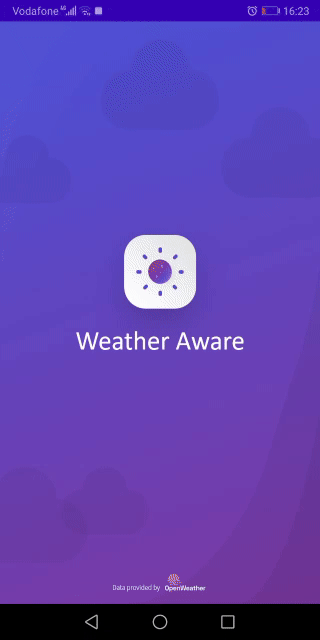

# WeatherApp

Android Mobile Application that displays the weather status and the temperature 
from your location. Also, you can pick a specific location on the map and add it to a 
list of favorite locations and get all the weather information at this location. In 
addition you can set an alert for rain, wind, fog, snow … etc.

<h2 id="Outputs">Outputs</h2>

## Features
* MVVM architecture.
* Use [OpenWeatherMap](https://openweathermap.org/) API.
* Automatic notifications about weather alerts.
* Custom alarms in a specific time range .
* Change location provider (GPS, Google-Maps Location).
* Support two language (English, Arabic).
* Change temperature unit (Celsius, Kelvin, Fahrenheit).
* Change wind speed unit (m/s, mph).
* Local data with Room Persistence.
* Auto update weather per 15 minutes with Jetpack WorkManager.

